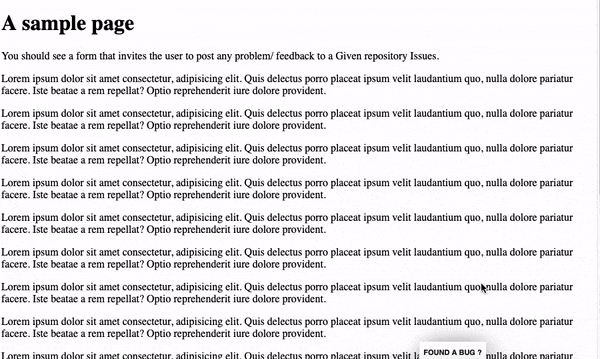

# Portable GitHub Issues Form

Easily add a beautiful Bug Report form on your website/application, that is sent to a GitHub repository Issues.
3 lines of code and you are done.

[Demo](http://pixeline.tk/portable-github-issues-form/)



## How to use 

Add the provided javascript file right before the end body tag, then instantiate the Issue object, using your project's repository credentials :

``` javascript
<script src="https://cdn.jsdelivr.net/gh/pixeline/portable-github-issues-form/bundle.js" ></script>
<script>
var githubForm =  new GithubIssueForm({ 'token': 'xxx', 'useragent': 'portable-github-issues-form', 'repository': 'pixeline/portable-github-issues-form', 'milestone': null });
githubForm.inject();
Issue.inject();
</script>
```

## Configuration

The `function` accepts the following `options`:
*   __token__: GitHub [access token][github-token] (*required*).
*   __useragent__: [user agent][github-user-agent] `string`.
*   __body__: issue content.
*   __assignees__: GitHub usernames of assigned users.
*   __milestone__: associated milestone `number`.
*   __labels__: `array` of associated labels.


To authenticate with GitHub, set the token option.

``` javascript
var opts = {
    'token': 'tkjorjk34ek3nj4!'
};
```

## Want to contribute ? 

`npm install -g watchify browserify`

then

`watchify ./src/portable-github-issues-form.js -o bundle.js` 

## Credits 
- post issue to github function : https://github.com/kgryte/github-create-issue
- GitHub API documentation: https://developer.github.com/v3/issues/#create-an-issue